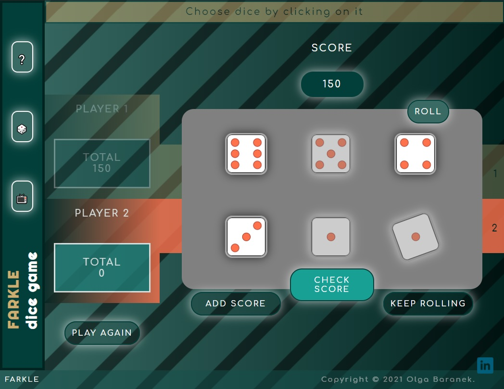
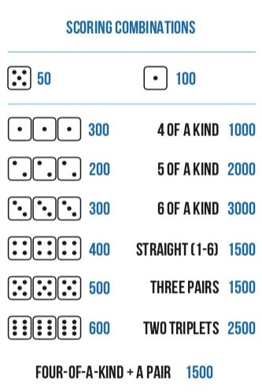

# FARKLE-dice-game

Farkle is a popular dice game, here designed for two players only.

Players roll different dice combinations with six dice. Each player can win by scoring 10,000 or more points.

📌 HOW TO RUN THE GAME.

Hit the 'Code' button and clone the repository or download ZIP. Open the repository trough Visual Studio Code or other code editor, then run the HTML file in the browser.

📌 How to play ?

Visit https://gathertogethergames.com/farkle?rq=farkle to read more about FARKLE and watch the tutorial video.

All the rules apply except for two minor ones. This means:
◽ Each player does not have to score a minimum of 500 points in order to start the game.
◽ If a current player gets 10.000 points the game is finished and he is the winner.

📌 POINTS.

